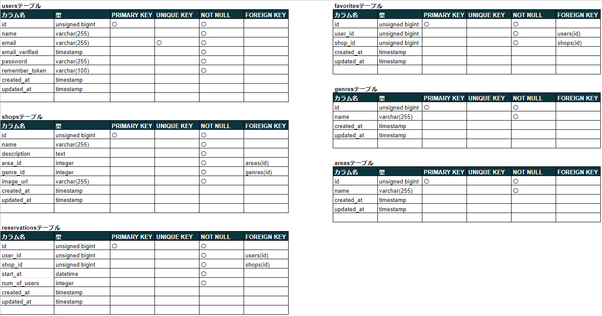

# アプリケーション名
Rese

20-30代の社会人を対象とした飲食店予約サービスです。

## 作成した目的
外部の飲食店予約サービスは手数料を取られるため、自社で予約サービスを持つことで手数料の削減を目指すため。

## アプリケーションURL
デプロイURLなし
予約機能、マイページの閲覧はログインを行う必要があります。

## 他のリポジトリ
Github：https://github.com/tayu0801/advanced_term_rese

## 機能一覧
会員登録
ログイン
ログアウト
ユーザー情報取得
ユーザー飲食店お気に入り一覧取得
ユーザー飲食店予約情報取得
飲食店一覧取得
飲食店詳細取得
飲食店お気に入り追加
飲食店お気に入り削除
飲食店予約情報追加
飲食店予約情報削除
エリア検索   ※1
ジャンル検索 ※1
店名検索
予約変更機能
バリデーション
レスポンシブデザイン
会員登録時のメール認証

※1
  エリアとジャンル検索は、店名検索ボックスにてEnterキーを押下する必要があります。

## 使用技術（実行環境）
- Laravel 8.83.23
- Laravel Breeze

## テーブル設計

## ER 図

## 環境構築
ローカル環境にて実行される場合,以下コマンドを実行してください。
1. php artisan migrate
2. php artisan db:seed

## その他
追加実装項目の評価機能、管理画面機能については
一度実装した後に細かい修正が必要なことが判明しましたが、
時間の関係で完成までできていません。
そのため実装途中のファイルが多数点在している状態です。
